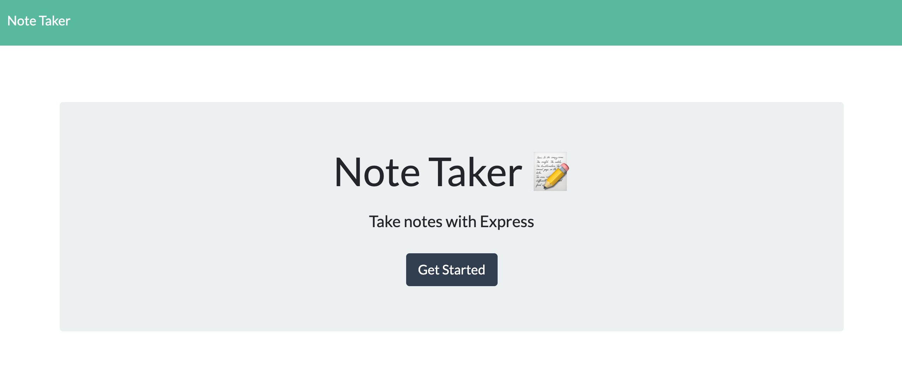
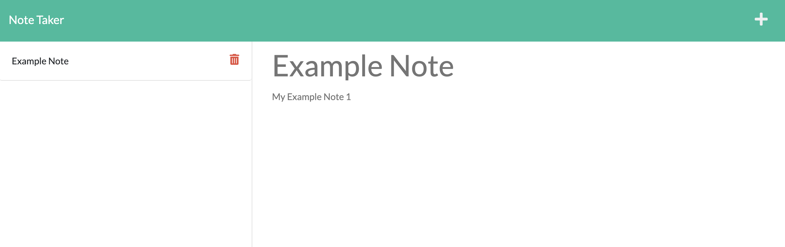

## Challenge 11 Note Taker

## Table of Contents

- [User Story](#user-story)
- [Description](#description)
- [Usage](#usage)
- [Requirements](#requirements)
- [Application](#application)
- [Questions](#questions)

## User Story

- AS A small business owner
- I WANT to be able to write and save notes
- SO THAT I can organize my thoughts and keep track of tasks I need to complete

## Description

This application is a Note Taker that can be used to write and save notes. This application uses an Express.js back end and will save and retrieve note data from a JSON file. The app is deployed from heroku.

## Usage

Open the app from the deployed link: https://calm-sea-99886.herokuapp.com/. Click get started on the main page. You will be taken to the notes page. Type in your note title and note and then press the floppy disc icon to save. You can add more notes by pressing the plus button, or see old notes by clicking on the individual note. Click the trash can beside any note to delete it.

## Requirements

- GIVEN a note-taking application
- WHEN I open the Note Taker
- THEN I am presented with a landing page with a link to a notes page
- WHEN I click on the link to the notes page
- THEN I am presented with a page with existing notes listed in the left-hand column, plus empty fields to enter a new note title and the note’s text in the right-hand column
- WHEN I enter a new note title and the note’s text
- THEN a Save icon appears in the navigation at the top of the page
- WHEN I click on the Save icon
- THEN the new note I have entered is saved and appears in the left-hand column with the other existing notes
- WHEN I click on an existing note in the list in the left-hand column
- THEN that note appears in the right-hand column
- WHEN I click on the Write icon in the navigation at the top of the page
- THEN I am presented with empty fields to enter a new note title and the note’s text in the right-hand column

## Application

[Link to application](https://calm-sea-99886.herokuapp.com/)

## Questions?

For any questions, please email gilinamcbride@gmail.com, or visit any other projects on [Github](github.com/gilinamcbride).
